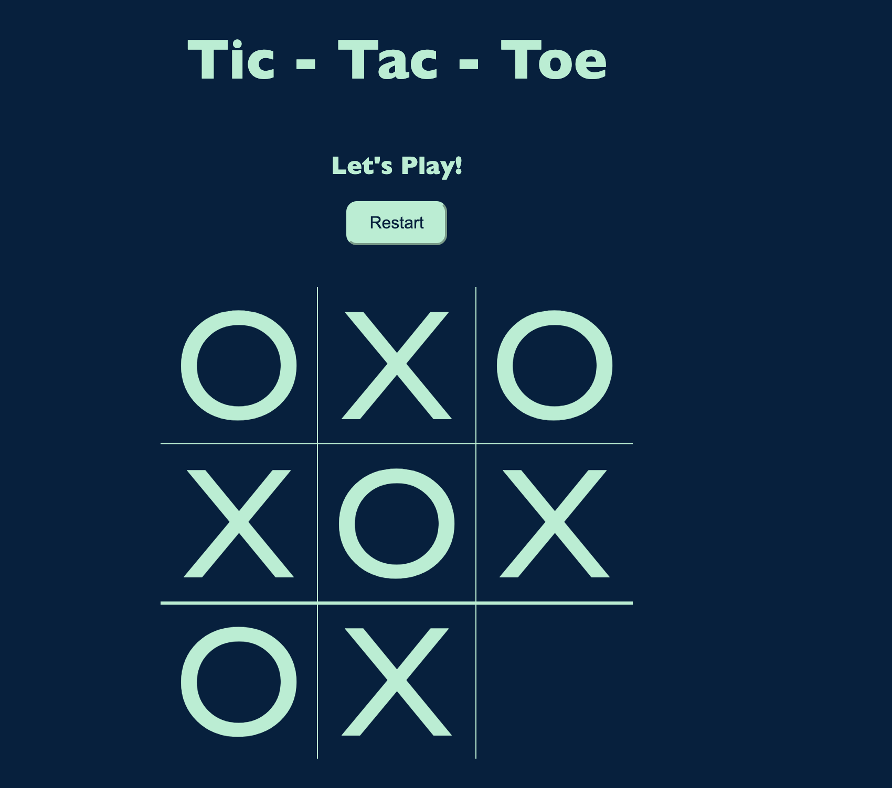

# 📊 Morning Challenge: Tic-Tac-Toe

 

 
 

### Goal: 
Create a two player Tic-Tac-Toe game. The users should be able to click to place their X or O and if they win the program should mention their win in the DOM. Please make the game as OOP as possible.

### How it's made
This game was made using HTML, CSS and Javascript. 

